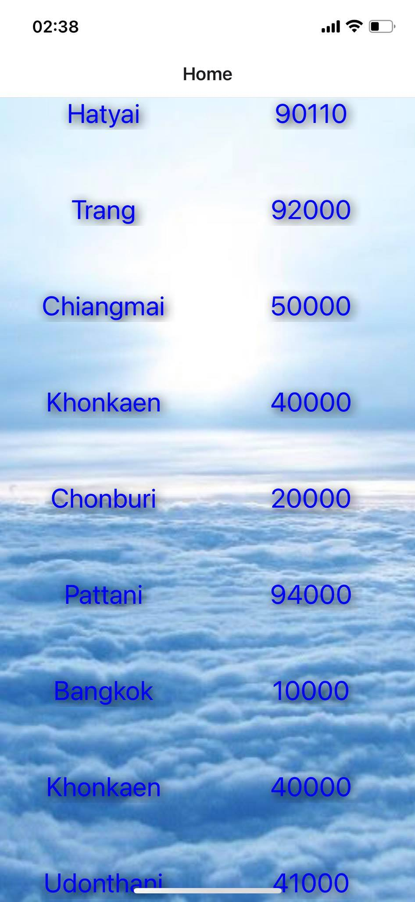

<h1>งานหลังการทดลอง</h1>
 
 1. ใส่ภาพพื้นหลังหน้า Home
 2. ปรับขนาด padding ของปุ่ม
 3. ปรับขนาดตัวอักษรของ place,code
 4. ปรับสีตัวอักษรของ place,code
 5. ปรับเงาให้เป็นสีดำ ปรับองศาของเงา ขนาดของเงา ที่ place,code
 6. ปรับตัวอักษรให้อยู่ตรงกลาง 

<h3> จัดทำโดย น.ส. วรนุช แดงวรวิทย์ 6210110566<h3>
<h3> ป.ล. เนื่องจากมีเพื่อนไม่ได้ส่งลิ้งเว็บ githup ใน LMS จึงขออนุญาตฝากส่งทางนี้แทนค่ะ<h3>
<h3>https://github.com/faithsila/3SA_04/commits/main<h3>